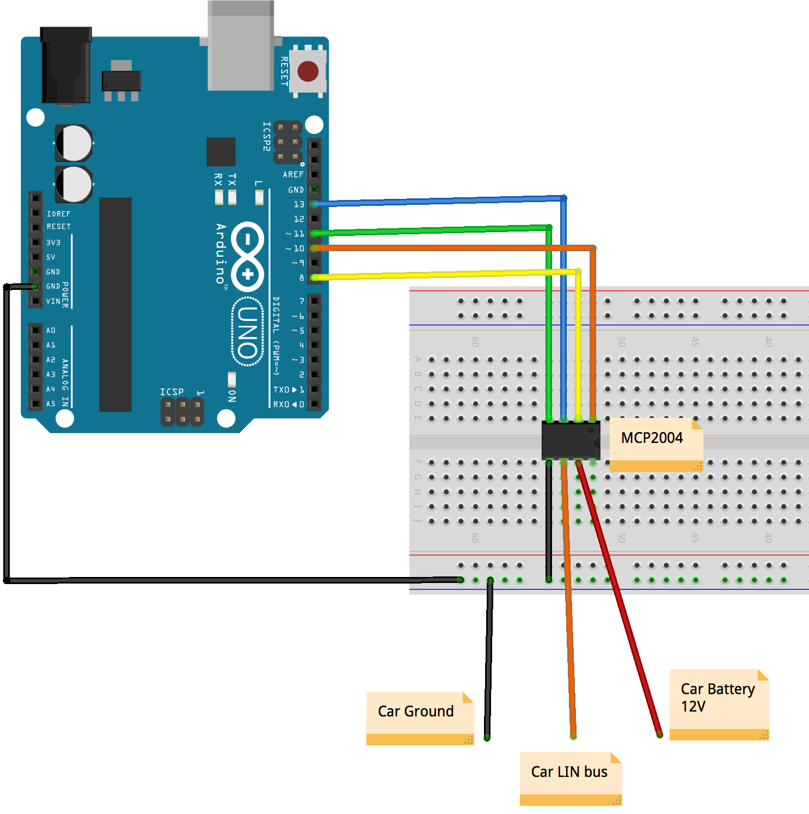

AlarmSim
========
# Problem
Audi TT mk1 alarm module failure due to corrosion casused by leaked battery.

# Idea
My idea is to use an ATTiny85 linked to a MCP2025 to replace the alarm module and possibly add additional intelligence and alerting via other methods (MQTT,SMS,Email, etc)
## Update
Possibly use an esp8266/esp32 instead of attiny85
Prototype will use uno

# schematic

# BOM

| Qty  | Item         |  notes           | Purchased         |
| ---- | ------------ | ---------------- |------------------ |
| 1    | ATTiny85     |                  | purchased in 2015 |
| 1    | MCP2025-330E |                  | purchased in 2015 |
| 1    | 1J0 973 703  | female plug for alarm  |                   |                       |
| 1    | 1J0 973 803  | male for above   |      |

# Todo

- [ ] Need to get working alarm
- [ ] Make sniffer circuit
- [ ] Arm alarm and log traffic
- [ ] Disarm alarm and log traffic
- [ ] Set alarm off via internal sensors and log traffic
- [ ] set alarm off via opening door without disarming
- [ ] replay commands in attiny
- [ ] remove alarm and simulate alarm in attiny

# Hold ups

I tried getting a working alarm however after 5 attempts i gave up for a bit after feeling deflated and it felt like i was the only person in the world doing this.

--2019
Get another alarm, hopefully this one will work so i can proceed further

